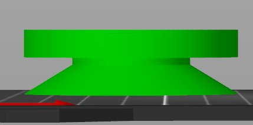
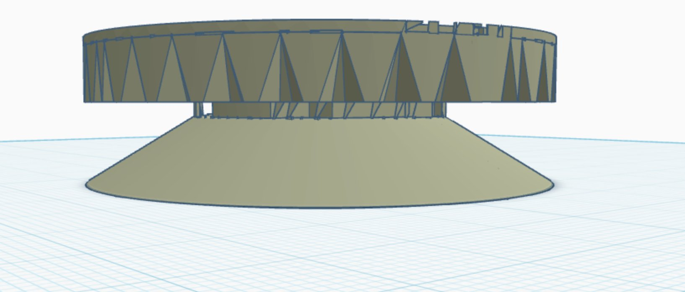
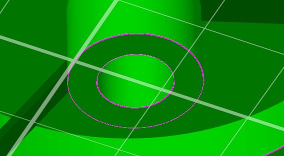

**Phase 04 · Final Design · 7 Iterations · Print 3x**

# Compliant Puck

The final design. One monolithic print — pedestal, spring, and cylinder in a single piece. Seven iterations refined the geometry until every element was proportional, printable, and functional.

### Print this file — 3 copies
`compliant_puck_FINAL.stl`
*One piece. No assembly, no hardware. Print 3, place in a triangle under the speaker.*

## Final specifications

**Outer diameter:** 57.9 mm  
**Total height:** 24.5 mm  
**Spring arms:** 3x BYU radial — 2.0mm wide x 1.52mm thick at 38/158/278 deg  
**Deflection:** 0.63mm under 733g  
**Max stress:** 45 MPa — PETG yield ~50 MPa  
**Pedestal:** 10mm hollow cylinder + 7mm hemisphere dome  

*Figure 4.1 — Final puck cross-section*

## The iteration journey

From wide-cone tapered base to clean cylinder-plus-dome. Each screenshot marks a decision point.



v1-v3 — tapered cone — too wide



v4 — full-size BYU spring — too large



Breakthrough — top-down concentric rings confirmed correct spring geometry at 0.40x scale

> This view locked the design. Seeing hub, arm region, and outer ring clearly defined in one view confirmed the spring would work. From here the only remaining question was the pedestal shape.

## Full iteration log

| Version | Change | Outcome |
| --- | --- | --- |
| v1_initial | Curved spiral arms | Wrong arm style — not BYU geometry |
| v2_40pct | BYU straight arms at 0.40x | Arms correct, geometry locked |
| v3_straight_pedestal | Hollow straight cylinder pedestal | Taper removed — cleaner |
| v4_spike | Spike tip at base | Wrong — spike too narrow |
| v5_dome | Hemisphere dome on full-width base | Dome too tall — disproportionate |
| FINAL | 7mm dome + 10mm straight cylinder | Correct geometry — clean and printable |

## Spring mechanics

```
delta = F x L^3 / (12 x E x I) // deflection = 0.63mm
sigma = 6 x F x L / (w x t^2) // max stress = 45 MPa
```

| Scale | OD | Arm w x t | Deflection | Stress | Valid |
| --- | --- | --- | --- | --- | --- |
| 0.20x | 29mm | 1.0x0.76mm | 1.25mm | 181 MPa | over yield |
| 0.35x | 51mm | 1.8x1.33mm | 0.71mm | 59 MPa | marginal |
| 0.40x | 58mm | 2.0x1.52mm | 0.63mm | 45 MPa | sweet spot |
| 0.50x | 72mm | 2.5x1.91mm | 0.50mm | 29 MPa | safe |