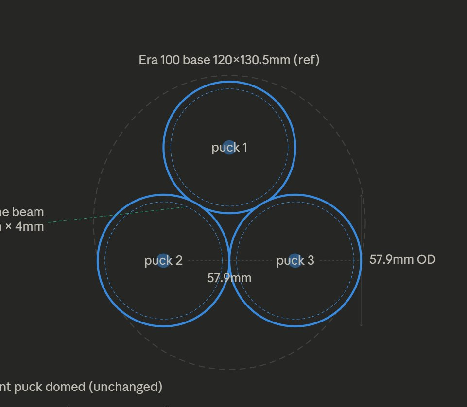
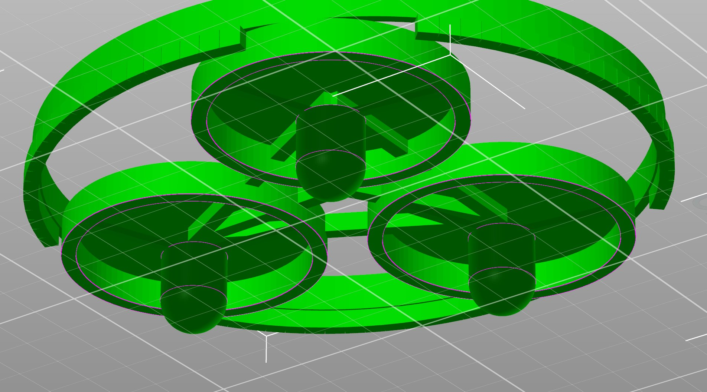
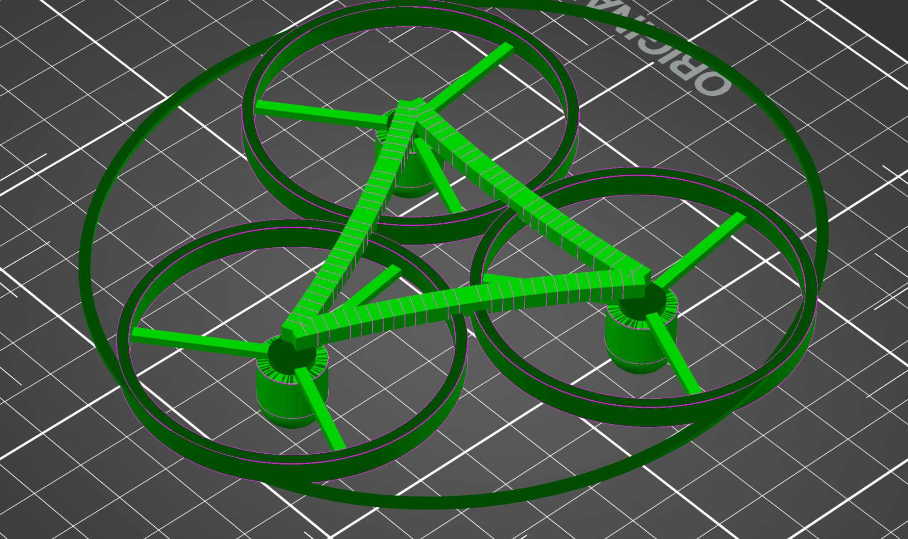
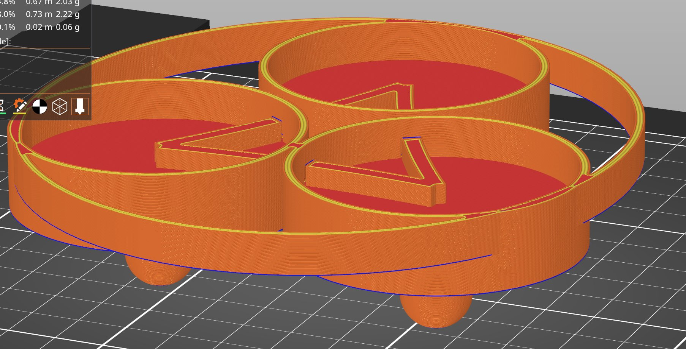
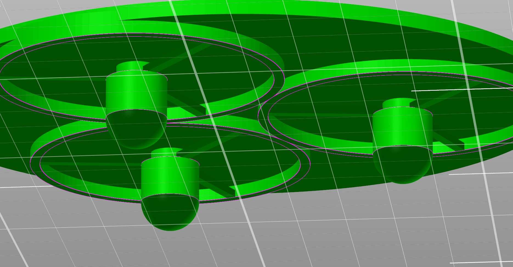

**Phase 05 · 6 Iterations · Optional Add-on**

# The Tray

An optional oval plate that holds all 3 pucks in the correct triangle layout and registers the speaker with a 1mm raised border. Six iterations to get the geometry right.

## What the tray does

Without a tray you place the 3 pucks manually in a triangle. The tray fuses them into one piece, sized to the Era 100 base (120x130.5mm), with a 1mm lip that stops the speaker sliding.

> The tray is optional. The 3 pucks work perfectly on their own. The tray is useful for a single registered piece that keeps puck positions fixed.

*Figure 5.1 — Tray layout and cross-section with Z levels*

## The iteration journey

Six versions across three approaches — wireframe, oval ring, and flat plate — before landing on the right geometry.

The puck triangle layout — 3 pucks mutually tangent at 57.9mm OD, circumradius 33.4mm

v1 — heavy outer ring and cross ribs — arms miss springs

v3 — cleaner wireframe oval ring — better direction

Slicer preview — pucks sliced with spring arms visible from below

Final tray — underside showing 3 domed pucks embedded below the 2mm oval plate

> The fix that cracked it: All puck geometry strictly below z=0. The plate is z=0 to +2mm. Puck rings, springs, pedestals and domes are z=0 to -16.5mm. Keeping zones separated fixed the pedestal-through-plate bug.

## Iteration log

| Version | Design approach | Problem |
| --- | --- | --- |
| tray_v1 | Wireframe — 3 curved arms + heavy outer ring | Arms miss springs |
| tray_v2 | Open top pucks, thin ring wall | Arms protrude as propeller blades |
| tray_v3 | Thin oval ring shell fused to puck rings | Cleaner but arms still exposed |
| tray_v4 | 2mm flat oval plate, pucks below | Pedestal poked above plate — Z bug |
| tray_v5 | v4 + 1mm raised lip border | Same Z bug persisted |
| tray_FINAL | All geometry strictly below z=0 | Correct — clean underside |

## Z level breakdown

| Level | Description |
| --- | --- |
| `z = +3.0mm` | top of 1mm raised lip |
| `z = +2.0mm` | top of oval plate — speaker sits here |
| `z = 0.0mm` | bottom of plate / top of puck rings |
| `z = -2.52mm` | bottom of spring zone |
| `z = -10.52mm` | bottom of pedestal |
| `z = -16.52mm` | dome tip — shelf contact point |